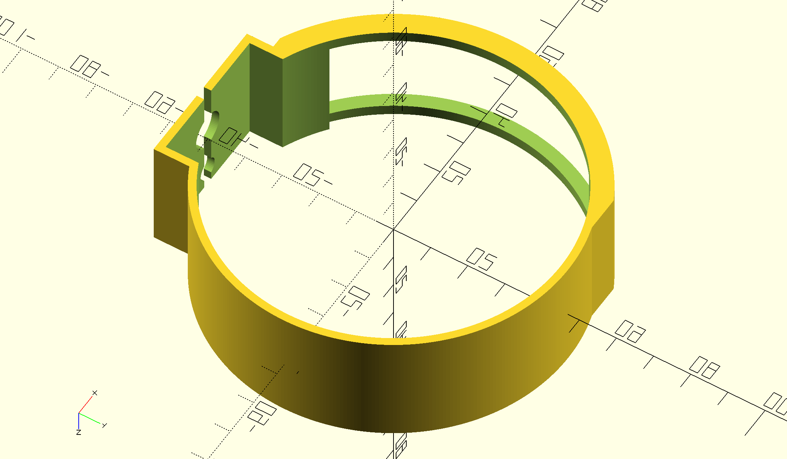
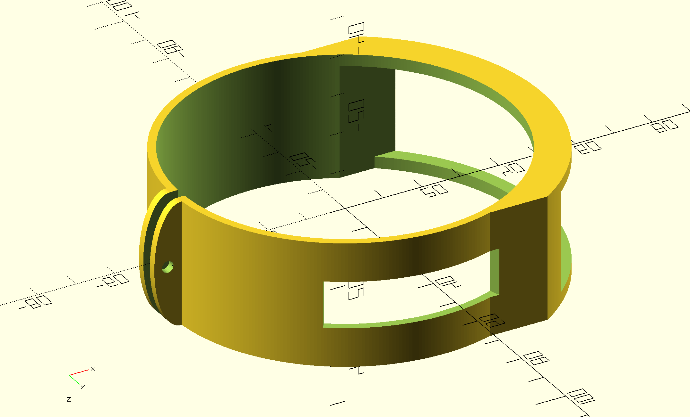

# 3D-printable lens switch guards for various DSLR / Mirrorless camera lenses

[STL](https://en.wikipedia.org/wiki/STL_(file_format)) printable files and [OpenSCAD](https://openscad.org) working files.

Note that these designs are prototypes and most have, as yet, not been printed, let alone tested.
Also, don't assume that the `.stl` files are correctly updated from the `.scad` files.

## Example views

## Available guards

STL links will display the file in an interactive viewer.

### Canon RF 800mm f/11 IS STM Lens

This lens has a tripod mounting foot (of sorts) in the same ring segment as the switches.
As such there are two prototypes for this lens, one that omits the foot mounting entirely,
with the intent that it'll be mounted with dual-sided adhesive tape, and one that tries to 
use the foot mount to hold the lens in place. Note that this will interfere with the mount;
best case is you'll likely need a longer mounting screw, worst case is your camera isn't as
secure on your tripod. All use of these designs is at your own risk.

Another fun aspect of this lens is that the ring segment is not flat, so fit is best-effort.

* Mount with foot: [STL](CanonRF800f11SwitchRingFoot.stl), [SCAD](CanonRF800f11SwitchRingFoot.scad)
* Mount without foot: [STL](CanonRF800f11SwitchRingNoFoot.stl), [SCAD](CanonRF800f11SwitchRingNoFoot.scad)

### Sigma 150-600mm f/5-6.3 DG OS HSM Contemporary Lens for Canon EF
### Sigma 100-400mm f/5-6.3 DG OS HSM Contemporary Lens for Canon EF

These lenses are a very similar design; the lens segments are unobstructed by any foot mount 
and have a flat cross-section. Current designs have a fitting for a #4 closure bolt on the underside.

* 100-400: [STL](Sigma100-400SwitchRing.stl), [SCAD](Sigma100-400SwitchRing.scad)
* 150-600: [STL](Sigma150-600SwitchRing.stl), [SCAD](Sigma150-600SwitchRing.scad)
